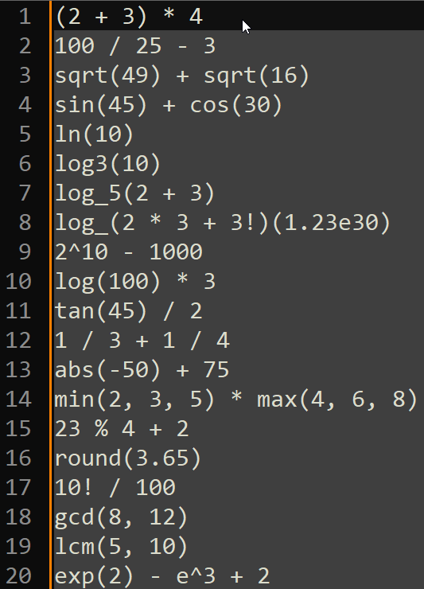
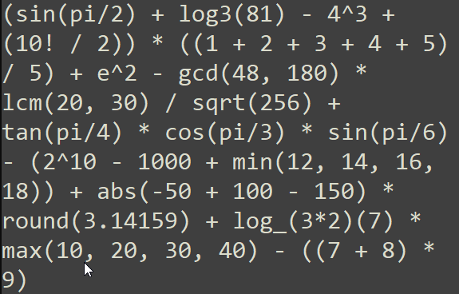

# Self-Explanatory Demo

# Installation
1. `cd evaluate-highlighted-text`
2. `pip install pip-tools`
3. `pip-compile`
4. `pip-sync`
5. `python -m evaluate_highlighted_text.defaults.math` (to test)
6. `python examples/main.py` (to use)

## TODO explain how to extend the tool

Until I fill out this readme, just look at [examples/main.py](./examples/main.py). It's pretty simple.
